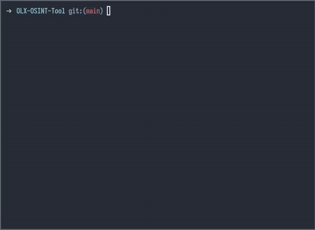

# OLX OSINT Tool
[](https://github.com/0xA7404A/OLX-OSINT-Tool)


**A simple tool for tracking OLX users _(for educational purposes only, of course)_.**



## Usage
- Clone repository with: `git clone https://github.com/0xA7404A/OLX-OSINT-Tool.git && cd OLX-OSINT-Tool`
- Execute `python3 tool.py`
- A JSON file with gathered data will be saved in your current directory. Enjoy!

## What's this?
It's a simple Python script that scrapes all of the OLX offers for a given place and returns data about the sellers.

## Data structure
```json
[
  {
    "name": "Seller Name",
    "offers": [
      "https://www.olx.pl/offer/url"
    ],
    "fb_connected": true,
    "avatar": "https://avatar/url/",
    "last_online": "dziś o 21:37",
    "url": "https://www.olx.pl/user/url",
    "registered_since": "grudzień 2019"
  }
]
```
